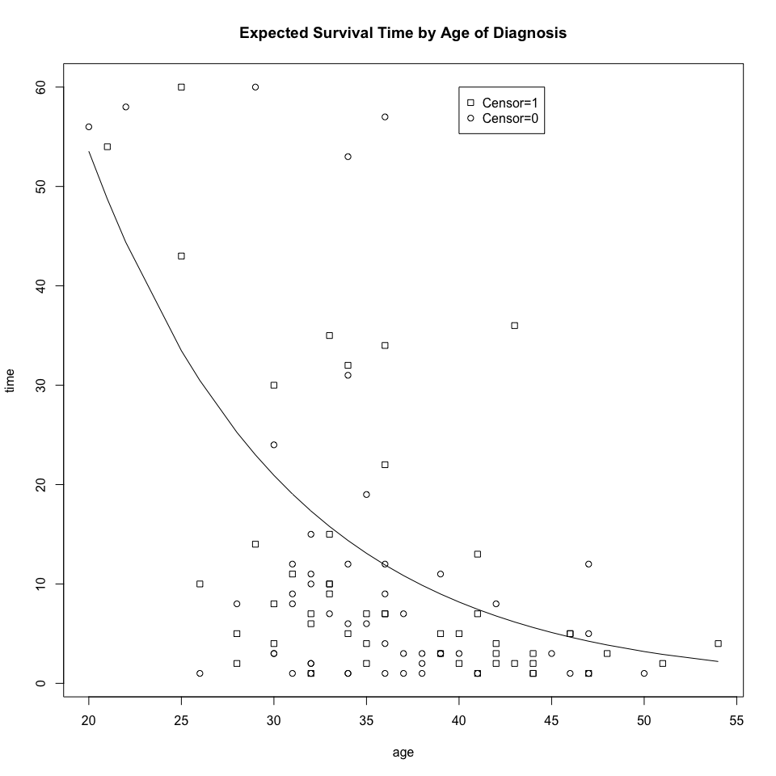
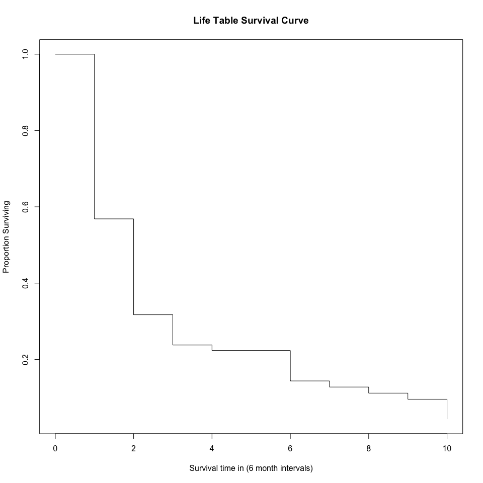
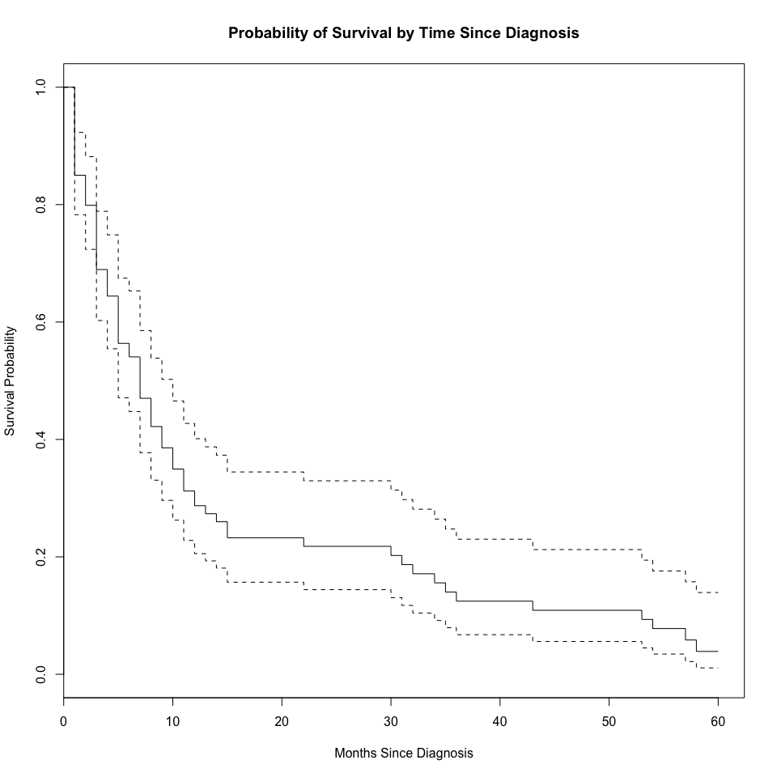
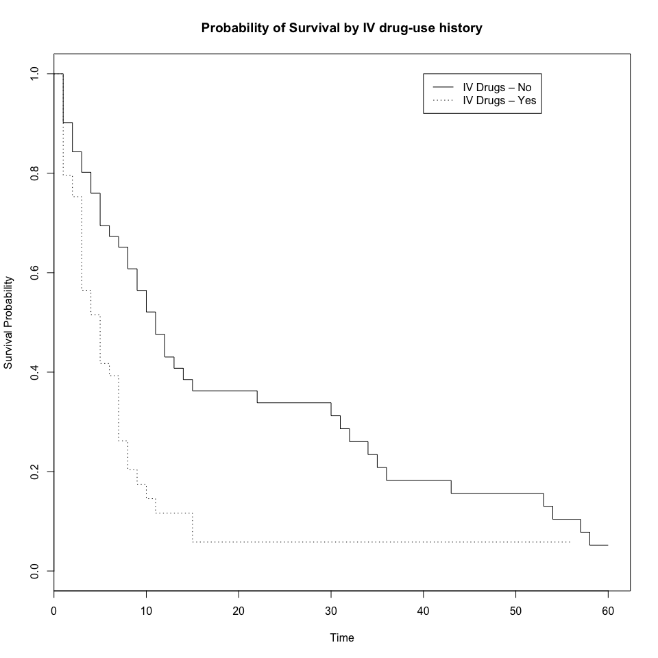
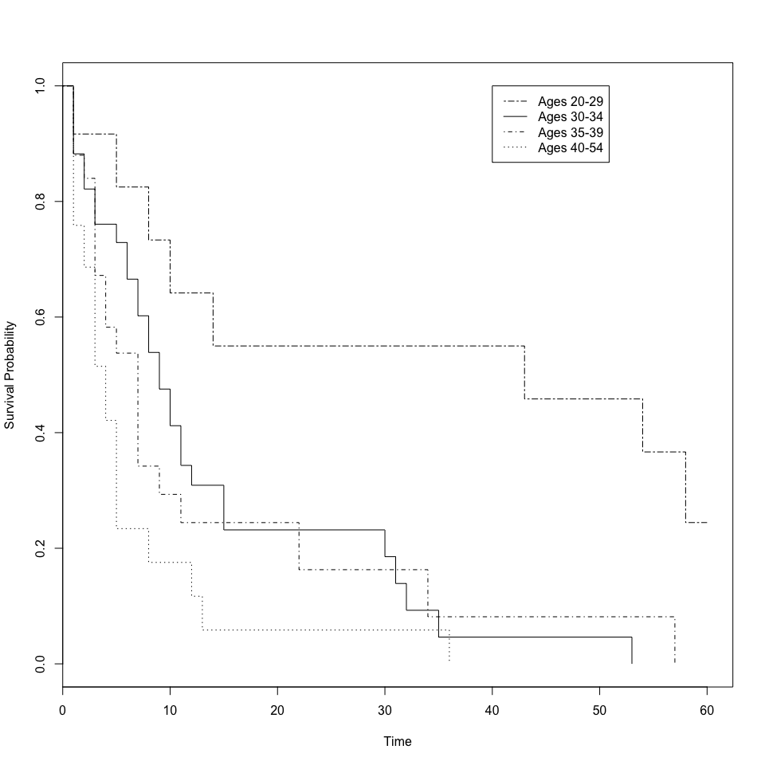

Survival Analysis of HMO-HIV+ Data
================
Chad Evans

Built with 3.3.2. Last run on 2017-08-09.

-   [Configure](#config)
    -   Libraries
    -   directories
    -   data
-   [Exploratory Analysis](#explore)
-   [Nonparametric Approaches](#nonparam)
    -   [Life Table (Actuarial) Method](#LTMethod)
    -   [Kaplan-Meier (Product limit) Estimator](#KM)
        -   [Multiple Groups](#MG)
            -   [Patients with and without a history of IV drug use](#IV)
            -   [Patients in different age groups](#ages)
        -   [Statistical Test for differences](#stat)
-   [Regression Models](#reg)
    -   [Semi-parametric Cox Model](#semiparam)
    -   [Parametric Accelerated Failure Time (AFT) Models](#AFT)
-   [Extensions](#extentions)
    -   [Strata](#strata)
    -   [Robust Standard Errors](#robust)
    -   [Regularization](#ridge)

### Configure

``` r
library(tidyverse)
library(survival)
library(KMsurv)
library(knitr)
library(car)
```

``` r
hmohiv<-read_csv(file.path(data_directory, "hmohiv.csv"))
attach(hmohiv)
hmohiv
```

    ## # A tibble: 100 x 7
    ##       ID  time   age  drug censor  entdate  enddate
    ##    <int> <int> <int> <int>  <int>    <chr>    <chr>
    ##  1     1     5    46     0      1  5/15/90 10/14/90
    ##  2     2     6    35     1      0  9/19/89  3/20/90
    ##  3     3     8    30     1      1  4/21/91 12/20/91
    ##  4     4     3    30     1      1   1/3/91   4/4/91
    ##  5     5    22    36     0      1  9/18/89  7/19/91
    ##  6     6     1    32     1      0  3/18/91  4/17/91
    ##  7     7     7    36     1      1 11/11/89  6/11/90
    ##  8     8     9    31     1      1 11/25/89  8/25/90
    ##  9     9     3    48     0      1  2/11/91  5/13/91
    ## 10    10    12    47     0      1  8/11/89  8/11/90
    ## # ... with 90 more rows

The hmohiv dataset is from a hypothetical HMO-HIV+ study of 100 indiviudals who received an hiv diagnosis. Every subject has an ID. Time refers to the time between entry date (entdate) and end date (enddate). We have the subject's age and whether or not he or she has a history of IV drug use. We also know whether the individual was censored, where 1 indicates death from AIDS-related factors and 0 indicates the subject was alive at study end or lost to follow-up.

Exploratory Analysis
--------------------

Let's plot the time in study (along with censor status) and plot that against each participant's age. I also fit a superimposed exponential function--one option to describe these relatinoships.

``` r
mod <- survreg( Surv(time, censor) ~ age, dist="exponential")
pred <- predict(mod, type="response") 
ord<-order(age)
age_ord<-age[ord]
pred_ord<-pred[ord]
plot(age, time, pch=c(0,1), main="Expected Survival Time by Age of Diagnosis")
lines(age_ord, pred_ord)
legend(40, 60, c("Censor=1", "Censor=0"), pch=c(0,1))
```



Nonparametric Approaches
------------------------

### Life Table (Actuarial) Method

``` r
intervals<-6 # number of intervals for life table
hmohiv$interval<-floor(hmohiv$time/intervals) # assigns intervals  
ltab.data<-hmohiv %>%
  select(interval,censor) %>%
  group_by(interval) %>%
  summarise(die=sum(censor), count=n())
detach()
```

``` r
attach(ltab.data)
int<-ltab.data$interval
int[length(ltab.data$interval)+1]=NA #length is 1 + nlost and nevent 
nevent=ltab.data$die # the number of ind.s who experienced the event
nlost=ltab.data$count - ltab.data$die # the number of ind.s lost/not followed or withdrawn
lifetable<-lifetab(int, 100, nlost, nevent)
kable(lifetable)
```

|       |  nsubs|  nlost|  nrisk|  nevent|       surv|        pdf|     hazard|    se.surv|     se.pdf|  se.hazard|
|-------|------:|------:|------:|-------:|----------:|----------:|----------:|----------:|----------:|----------:|
| 0-1   |    100|     10|   95.0|      41|  1.0000000|  0.4315789|  0.5503356|  0.0000000|  0.0508163|  0.0826301|
| 1-2   |     49|      3|   47.5|      21|  0.5684211|  0.2513019|  0.5675676|  0.0508163|  0.0467169|  0.1187616|
| 2-3   |     25|      2|   24.0|       6|  0.3171191|  0.0792798|  0.2857143|  0.0498144|  0.0306717|  0.1154460|
| 3-4   |     17|      1|   16.5|       1|  0.2378393|  0.0144145|  0.0625000|  0.0467064|  0.0142548|  0.0624695|
| 4-5   |     15|      1|   14.5|       0|  0.2234248|  0.0000000|  0.0000000|  0.0460463|        NaN|        NaN|
| 5-6   |     14|      0|   14.0|       5|  0.2234248|  0.0797946|  0.4347826|  0.0460463|  0.0330012|  0.1897906|
| 6-7   |      9|      0|    9.0|       1|  0.1436302|  0.0159589|  0.1176471|  0.0411688|  0.0157262|  0.1174433|
| 7-8   |      8|      0|    8.0|       1|  0.1276713|  0.0159589|  0.1333333|  0.0395670|  0.0157262|  0.1330367|
| 8-9   |      7|      0|    7.0|       1|  0.1117124|  0.0159589|  0.1538462|  0.0377024|  0.0157262|  0.1533903|
| 9-10  |      6|      1|    5.5|       3|  0.0957535|  0.0522292|  0.7500000|  0.0355338|  0.0280888|  0.4014135|
| 10-NA |      2|      2|    1.0|       0|  0.0435243|         NA|         NA|  0.0259652|         NA|         NA|

Variance estimated using Greenwood's formula.

``` r
plot(int[1:11], lifetable[,5], type="s", xlab="Survival time in (6 month intervals)", ylab="Proportion Surviving", main="Life Table Survival Curve")
```



``` r
detach()
```

### Kaplan-Meier (Product limit) Estimator of the Survival Curve

One major difference with the Life Table method: if observations are censored on the same month (or time unit) that events occurred, they are assumed to be at risk for the whole month (rather than just half the month). This method is most appropriate for small data sets with exact times of censoring and events. The KM estimator is a limiting form of the actuarial method, such that the time intervals are only as large as the units of measurement.

``` r
attach(hmohiv)
hmohiv.surv <- survfit( Surv(time, censor)~ 1, conf.type="log", type="kaplan-meier")
plot (hmohiv.surv,  xlab="Months Since Diagnosis", ylab="Survival Probability", main="Probability of Survival by Time Since Diagnosis")
```



We can plot this figure with confidence intervals as well. The default (above) is log, which calculates intervals based on the cumulative hazard or log(survival). Other options include plain or log-log. IDRE has code for another method called loghall, which renders results very similar to log.

### Multiple Groups

#### Comparing patients with and without a history of IV drug use

##### Fitting the Model

``` r
drug.surv <- survfit( Surv(time, censor)~ strata(drug), data=hmohiv, type="kaplan-meier")
print(drug.surv)
```

    ## Call: survfit(formula = Surv(time, censor) ~ strata(drug), data = hmohiv, 
    ##     type = "kaplan-meier")
    ## 
    ##                      n events median 0.95LCL 0.95UCL
    ## strata(drug)=drug=0 51     42     11       8      30
    ## strata(drug)=drug=1 49     38      5       3       7

``` r
plot(drug.surv, lty=c(1,3), xlab='Time', ylab='Survival Probability', main="Probability of Survival by IV drug-use history") 
legend(40, 1.0, c('IV Drugs – No', 'IV Drugs – Yes') , lty=c(1,3))
```



##### Statistical Test for differences

The following function implements the G-rho family of Harrington and Fleming (1982), with weights on each death of S(t)^rho, where S is the Kaplan-Meier estimate of survival. With rho = 0 this is the log-rank or Mantel-Haenszel test, and with rho = 1 it is equivalent to the Peto & Peto modification of the Gehan-Wilcoxon test. Allison also discusses other possibilities, including the Wilcoxon test, the Cox test of equality, the Tarone-Ware test of equality, the Peto-Peto-Prentice test of equality and the Generalized Fleming-Harrington test of equality.

``` r
survdiff(Surv(time, censor) ~ drug, data=hmohiv,rho=0) # log-rank or Mantel-Haenszel test
```

    ## Call:
    ## survdiff(formula = Surv(time, censor) ~ drug, data = hmohiv, 
    ##     rho = 0)
    ## 
    ##         N Observed Expected (O-E)^2/E (O-E)^2/V
    ## drug=0 51       42     54.9      3.02      11.9
    ## drug=1 49       38     25.1      6.60      11.9
    ## 
    ##  Chisq= 11.9  on 1 degrees of freedom, p= 0.000575

The null hypothesis for a logrank test is that the groups have the same survival. In this case, the Chi-square statistic is significant. The survival curve, therefore, differs based on whether the patient has a history of IV drug use. But the KM approach is not able to estimate survival adjusted for covariates. For this reason, we will return to the semi-parametric Cox Proportional hazards model and also parametric survival models shortly.

#### Comparing patients in different age groups

##### Fitting the Model

First, we fit the KM model.

``` r
agecat <- cut(age, c(19.9, 29, 34, 39, 54.1))
age.surv <- survfit( Surv(time, censor)~ strata(agecat), data=hmohiv, type="kaplan-meier")
print(age.surv)
```

    ## Call: survfit(formula = Surv(time, censor) ~ strata(agecat), data = hmohiv, 
    ##     type = "kaplan-meier")
    ## 
    ##                           n events median 0.95LCL 0.95UCL
    ## strata(agecat)=(19.9,29] 12      8     43      10      NA
    ## strata(agecat)=(29,34]   34     29      9       7      15
    ## strata(agecat)=(34,39]   25     20      7       4      22
    ## strata(agecat)=(39,54.1] 29     23      4       3       5

``` r
plot(age.surv, lty=c(6, 1, 4, 3), xlab="Time", ylab="Survival Probability")
legend(40, 1.0, c("Ages 20-29", "Ages 30-34", "Ages 35-39", "Ages 40-54"), lty=c(6, 1, 4, 3)) 
```



Younger patients survive longer. We can test to be sure the survival curves are different using the log rank (or other) test.

##### Statistical tests of differences

``` r
survdiff(Surv(time, censor) ~ agecat, rho=0)
```

    ## Call:
    ## survdiff(formula = Surv(time, censor) ~ agecat, rho = 0)
    ## 
    ##                   N Observed Expected (O-E)^2/E (O-E)^2/V
    ## agecat=(19.9,29] 12        8     19.9   7.10608   12.4419
    ## agecat=(29,34]   34       29     29.4   0.00641    0.0117
    ## agecat=(34,39]   25       20     17.8   0.26894    0.3834
    ## agecat=(39,54.1] 29       23     12.9   7.98170   11.1799
    ## 
    ##  Chisq= 19.9  on 3 degrees of freedom, p= 0.000178

The log rank chi-square test provides statistical evidence that the survival curves differ by age group.

#### Summary of Nonparametric models

Kaplan-Meier curves and logrank tests are most useful when the predictor variable is categorical (e.g., drug vs. placebo), or takes a small number of values (e.g., drug doses 0, 20, 50, and 100 mg/day) that can be treated as categorical. The logrank test and KM curves don’t work easily with quantitative predictors. For quantitative predictor variables, we turn to alternative methods like the Cox proportional hazards model or Accelerated Failure Time (AFT) models. Such models work also with categorical predictor variables, encoded as {0,1} indicator or dummy variables.

Regression Models for Survival Data
-----------------------------------

There are two types of regression models: 1) semi-parametric models, the most common of which is the Cox model. Proportional hazard models, like the Cox model, assume that the effect of a covariate is to multiply the hazard by some constant. Hazards are “proportional” because the ratio of the hazards for any two individuals is constant, i.e., it does not depend on time. 2) parametric AFT models, where it is assumed that log(To) has a specific probability distribution, assume that the effect of a covariate is to accelerate or decelerate the life course of a disease by some constant.

One case worth noting is the Weibull distribution (including the exponential distribution as a special case) can be parameterised as either a proportional hazards model or an AFT model. It is the only family of distributions that possesses this property.

### Semi-parametric Cox Proportional Hazards Model

The biggest advantage of the Cox model relates to its flexibilty of functional form. Parametric models require a choice of functional form and often there is no good basis for which to choose. In many instances this can be overly restrictive. The Cox model requires no commitment to functional form. This is a semi-parametric model in that only the effects of covariates are parametrized, and not the hazard function. In other words, we don't make any distributional assumptions about survival times.

First, we fit a simple Cox model predicting time to death from a binary predictor of IV drug use (whether or not the patient had a history of IV drug use). We employ the efron method of dealing with ties, although other popular methods (e.g., breslow method) are available. The Efron approximation is more accurate when dealing with tied death times, and is as efficient computationally.

``` r
coxph_mod1 <- coxph( Surv(time,censor)~drug, data=hmohiv, method="efron") # breslow option available
summary(coxph_mod1)
```

    ## Call:
    ## coxph(formula = Surv(time, censor) ~ drug, data = hmohiv, method = "efron")
    ## 
    ##   n= 100, number of events= 80 
    ## 
    ##        coef exp(coef) se(coef)     z Pr(>|z|)    
    ## drug 0.8309    2.2953   0.2418 3.436  0.00059 ***
    ## ---
    ## Signif. codes:  0 '***' 0.001 '**' 0.01 '*' 0.05 '.' 0.1 ' ' 1
    ## 
    ##      exp(coef) exp(-coef) lower .95 upper .95
    ## drug     2.295     0.4357     1.429     3.687
    ## 
    ## Concordance= 0.611  (se = 0.036 )
    ## Rsquare= 0.11   (max possible= 0.997 )
    ## Likelihood ratio test= 11.6  on 1 df,   p=0.0006593
    ## Wald test            = 11.81  on 1 df,   p=0.0005903
    ## Score (logrank) test = 12.33  on 1 df,   p=0.0004464

Proportional Hazards models and AFT models must be interpreted in different ways. AFT models give the percentage change in survival time. Cox models give the percentage change to the hazard at all time points, following the formula here:

h(t)=h0(t)exp(β′x)

In this case, the effect of past IV drug use on time to death has an estimated coefficient of 0.8309. Exponentiated, this means that subjects with a history of IV drug multiply their baseline hazard (h0(t)) by a factor of 2.3. Their risk of dying from AIDS is 130% (100\*(e^beta -1) higher than subjects without IV drug histories (at all time points). Importantly, Cox models state that this is the impact on the subject's hazard at any given time, t. It does not, however, imply an expansion (or contraction) of the lifespan of the subject.

Now let's build a more comprehensive model.

``` r
coxph_mod2 <- coxph( Surv(time,censor)~drug + age + drug*age, data=hmohiv ,method="efron") # breslow option available
summary(coxph_mod2)
```

    ## Call:
    ## coxph(formula = Surv(time, censor) ~ drug + age + drug * age, 
    ##     data = hmohiv, method = "efron")
    ## 
    ##   n= 100, number of events= 80 
    ## 
    ##                coef  exp(coef)   se(coef)      z Pr(>|z|)    
    ## drug      1.0430451  2.8378453  1.2760106  0.817    0.414    
    ## age       0.0974255  1.1023294  0.0230186  4.232 2.31e-05 ***
    ## drug:age -0.0007227  0.9992775  0.0342916 -0.021    0.983    
    ## ---
    ## Signif. codes:  0 '***' 0.001 '**' 0.01 '*' 0.05 '.' 0.1 ' ' 1
    ## 
    ##          exp(coef) exp(-coef) lower .95 upper .95
    ## drug        2.8378     0.3524    0.2327    34.604
    ## age         1.1023     0.9072    1.0537     1.153
    ## drug:age    0.9993     1.0007    0.9343     1.069
    ## 
    ## Concordance= 0.711  (se = 0.042 )
    ## Rsquare= 0.324   (max possible= 0.997 )
    ## Likelihood ratio test= 39.13  on 3 df,   p=1.627e-08
    ## Wald test            = 36.08  on 3 df,   p=7.198e-08
    ## Score (logrank) test = 39.93  on 3 df,   p=1.101e-08

IV drug-use history is not significant once age is taken into consideration. There must have been correlation with age that gave the impression drug-history mattered. Maybe younger people know about the risks of IV drug use or maybe it was taboo to reveal it to researchers. I suspect this is evidence of a successful campaign on the risk of IV drug-use that impacted drug use by younger generations.

Here, for every year increase in subject's age, we expect the baseline hazard to be multiplied by a factor of 1.1. This is equivalent to saying that each year of life increases the hazard of death by 10%.

R output also provides the exponentiated negative coefficient. To my understanding, that just allows you to compare the no-IV drug-use group relative to the baseline hazard of the IV drug-use group. So, a drug-free history reduces your hazard of death by AIDS by 9.3% or 100 \* (exp(-0.0974255)-1) at all time points.

I tested for an exponential function of age (age + I(age^2)), but the quadratic term was not significant.

#### Summary of Cox Proportional Hazard Models

If the proportional hazards assumption holds (or, is assumed to hold) then it is possible to estimate the effect of parameter(s) without any consideration of the baseline hazard function. This is in contrast to parametric models (discussed next).

### Parametric Accelerated Failure Time (AFT) Models

Next, we fit a parametric survival regression model. These are location-scale models for an arbitrary transform of the time variable; the most common cases use a log transformation, leading to accelerated failure time models. First, we assume the outcome has an exponential distribution--a good baseline distribution to start with (simplifies calculations). The exponential distribution implies a constant hazard rate. Finally, I model with the log-logistic transformation. This is one of the more popular transformations because, unlike the Weibull distribution, it can exhibit a non-monotonic hazard function which increases at early times and decreases at later times. It also has a closed form solution that speeds up computation (important because of the consequences of censoring). The advantage of the Weibull (and by extention the exponential), of course, is that it can be parameterised as a PH model or an AFT model. In other words, the Weibull family can be interpreted as affecting the risk of event occurance or the duration of the lifespan. Other less desirable functions include log normal, gamma and inverse gaussian functions.

``` r
attach(hmohiv)
mod <- survreg( Surv(time, censor) ~ age, dist="exponential")
summary(mod)
```

    ## 
    ## Call:
    ## survreg(formula = Surv(time, censor) ~ age, dist = "exponential")
    ##               Value Std. Error     z        p
    ## (Intercept)  5.8590     0.5853 10.01 1.37e-23
    ## age         -0.0939     0.0158 -5.96 2.59e-09
    ## 
    ## Scale fixed at 1 
    ## 
    ## Exponential distribution
    ## Loglik(model)= -275   Loglik(intercept only)= -292.3
    ##  Chisq= 34.5 on 1 degrees of freedom, p= 4.3e-09 
    ## Number of Newton-Raphson Iterations: 4 
    ## n= 100

For this first model, we parameterized log(t) using the exponential distribution as follows:

In the case of AFT models, the impact of covariates is to have a multiplicative effect on survival time. For a one unit increase in age, we expect a 100\*(exp(-0.0939)-1) percent change in survival time. So, for each year of age, we expect survival time to decrease by about nine percent. Because the coefficient is so small, you can actually just multiply the coef by 100 to find an approximation of the percentage change. It "accelerates" the life course by 9 percent, thereby shortening it.

While this is a good baseline, the log logistic transformation is more commonly used, thanks to its computational efficiently and (relative) flexibility of functional form.

``` r
mod <- survreg( Surv(time, censor) ~ age, dist="loglogistic")
summary(mod)
```

    ## 
    ## Call:
    ## survreg(formula = Surv(time, censor) ~ age, dist = "loglogistic")
    ##               Value Std. Error     z        p
    ## (Intercept)  5.2768     0.6539  8.07 7.07e-16
    ## age         -0.0924     0.0177 -5.24 1.65e-07
    ## Log(scale)  -0.4251     0.0920 -4.62 3.87e-06
    ## 
    ## Scale= 0.654 
    ## 
    ## Log logistic distribution
    ## Loglik(model)= -272.1   Loglik(intercept only)= -283.6
    ##  Chisq= 23.16 on 1 degrees of freedom, p= 1.5e-06 
    ## Number of Newton-Raphson Iterations: 4 
    ## n= 100

In this case, the log logistic performs similarly to the exponential distribution. Let's try a more complex model.

``` r
mod <- survreg( Surv(time, censor) ~ age + drug + age*drug, dist="exponential")
summary(mod)
```

    ## 
    ## Call:
    ## survreg(formula = Surv(time, censor) ~ age + drug + age * drug, 
    ##     dist = "exponential")
    ##                Value Std. Error      z        p
    ## (Intercept)  6.22124     0.7857  7.918 2.41e-15
    ## age         -0.09401     0.0212 -4.434 9.26e-06
    ## drug        -1.17608     1.2112 -0.971 3.32e-01
    ## age:drug     0.00456     0.0327  0.140 8.89e-01
    ## 
    ## Scale fixed at 1 
    ## 
    ## Exponential distribution
    ## Loglik(model)= -265.4   Loglik(intercept only)= -292.3
    ##  Chisq= 53.74 on 3 degrees of freedom, p= 1.3e-11 
    ## Number of Newton-Raphson Iterations: 4 
    ## n= 100

Using the exponential family, we see that the results here are comparable to the findings of the Cox proportional hazards model of the previous section. IV drug history does not impact the survival time. A one unit increase in age reduces the survival time by about 9 percent.

Time to Event
-------------

To predict the mean time to event, use the following:

### Extensions

We can also fit a model with different baseline survival shapes for each of the two drug groups (i.e., two different scale parameters). Here, I also robustified the standard errors using the robust argument. I also included a ridge penalty on both predictors to prevent overfitting.

``` r
mod <- survreg( Surv(time, censor) ~ age + strata(drug) + ridge(age, drug, theta=1), robust=TRUE, data=hmohiv, dist="loglogistic")
summary(mod)
```

    ## 
    ## Call:
    ## survreg(formula = Surv(time, censor) ~ age + strata(drug) + ridge(age, 
    ##     drug, theta = 1), data = hmohiv, dist = "loglogistic", robust = TRUE)
    ##                 Value Std. Err (Naive SE)     z        p
    ## (Intercept)  5.49e+00   0.5781      0.585  9.50 2.15e-21
    ## age         -8.61e-02   0.0153      0.150 -5.62 1.93e-08
    ## ridge(age)  -9.75e-22   0.0000      0.149  -Inf 0.00e+00
    ## ridge(drug) -8.90e-01   0.2132      0.212 -4.18 2.97e-05
    ## drug=0      -4.44e-01   0.1142      0.127 -3.89 1.00e-04
    ## drug=1      -6.40e-01   0.1325      0.135 -4.83 1.37e-06
    ## 
    ## Scale:
    ## drug=0 drug=1 
    ##  0.641  0.527 
    ## 
    ## Log logistic distribution
    ## Loglik(model)= -263.6   Loglik(intercept only)= -282.8
    ##  Chisq= 38.47 on 1 degrees of freedom, p= 5.5e-10 
    ## (Loglikelihood assumes independent observations)
    ## Number of Newton-Raphson Iterations: 1 4 
    ## n= 100
